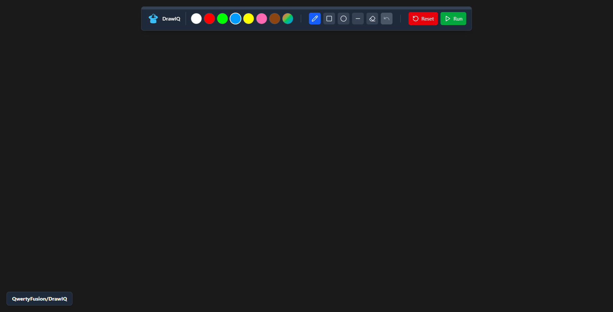

# 🐦 DrawIQ


<p align="center"><strong>Drawings come to life with DrawIQ!</strong></p>

DrawIQ is an innovative web application that allows users to draw, write math problems, or sketch anything, and then leverages AI to interpret and solve those drawings. With a user-friendly interface and powerful analysis capabilities, DrawIQ transforms your creative expressions into actionable insights.

---

## ✨ Features
- **Interactive Drawing Canvas**: Create drawings with various tools including pencil, eraser, shapes, and more.
- **Color Picker**: Choose from a palette of colors or create custom colors for your drawings.
- **Shape Preview**: Get real-time previews of shapes like rectangles, circles, and lines while drawing.
- **Undo/Redo Functionality**: Easily revert or redo your actions to refine your artwork.
- **Image Analysis**: Upload your drawings for AI analysis to solve mathematical expressions and interpret abstract concepts.
- **Responsive Design**: Optimized for both desktop and mobile devices.

---

## 🌐 Live Website Link
You can visit the live website at [https://drawiq.onrender.com](https://drawiq.onrender.com)

---

## 🖼️ Preview  

<div style="display: flex; justify-content: center;">
  
</div>

---

## 📜 License  

DrawIQ is open-source and released under the **MIT License**.  
See the [LICENSE](https://github.com/QwertyFusion/DrawIQ/blob/main/LICENSE) file for more details.  

---

## 🚀 Getting Started  

### 1️⃣ Clone the Repository  
```bash  
git clone https://github.com/QwertyFusion/DrawIQ.git  
cd DrawIQ  
```

### 2️⃣ Set Up Environment Variables  
Create a `.env` file and fill in the required fields as per `.env.example`.  

### 3️⃣ Install Dependencies
Use the following command in both `root` and `frontend` folders
```bash  
npm install  
# or  
yarn install  
# or  
pnpm install  
# or  
bun install  
```

### 4️⃣ Run the Development Server  
Use the following command in both `root` and `frontend` folders
```bash  
npm run dev  
# or  
yarn dev  
# or  
pnpm dev  
# or  
bun dev  
```

Now, open [http://localhost:5173](http://localhost:5173) in your browser to see DrawIQ in action!

### 5️⃣ Creating a build and running it  
Use the following command in the `root` folder to build
```bash  
npm run build   
```
Followed by the following command to start
```bash  
npm run start
# or
npm start   
```

Now, open [http://localhost:3000](http://localhost:3000) in your browser to see DrawIQ in action!  

---

## 🛠 Tools Used  

<ol>
  <li>Visual Studio Code</li>
  <li>React.js</li>
  <li>JavaScript</li>
  <li>Tailwind CSS</li>
  <li>Gemini API (AI Chatbot)</li>
  <li>Git & GitHub (Version Control)</li>
</ol>

---

## 🔗 Link to Tools  

<p align="left">
<a href="https://code.visualstudio.com" target="_blank" rel="noreferrer">
  
</a>&emsp;
<a href="https://react.dev/" target="_blank" rel="noreferrer">
  
</a>&emsp;
<a href="https://developer.mozilla.org/en-US/docs/Web/JavaScript" target="_blank" rel="noreferrer">
  
</a>&emsp;
<a href="https://tailwindcss.com/" target="_blank" rel="noreferrer">
  
</a>&emsp;
<a href="https://ai.google.dev/" target="_blank" rel="noreferrer">
  
</a>&emsp;
<a href="https://git-scm.com/" target="_blank" rel="noreferrer">
  
</a>&emsp;
<a href="https://github.com/" target="_blank" rel="noreferrer">
  
</a>
</p>

---

<h2>Developer</h2>
<ul>
  <li><a href="https://github.com/QwertyFusion">[@QwertyFusion]</a></li>
</ul>
</body>
